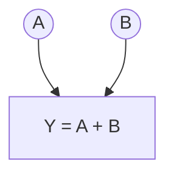
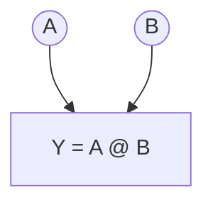
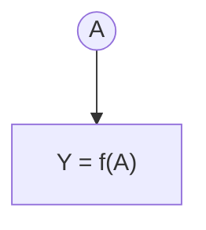

## Definition

$$
\text{Let f :}  \mathcal{T} → \mathbb{R} \text{ be a differentiable function, where } \mathcal{T} \text{ is the space of tensors.}
$$

$$
\text{The gradient of } f \text{ at } A \in \mathcal{T} \text{ is the tensor } 
\nabla f(A) \in \mathcal{T}
\text{ defined by:}
$$

$$
\forall\, dA \in \mathcal{T}, \text{ t.q. } \mathcal{d}_{dA}(-1) = \mathcal{d}_A(-1), \qquad 
\mathrm{D}f(A)[dA] = \langle \nabla f(A),\, dA \rangle
$$
This reads as the variation of $$f$$ evaluated at $$A$$ for any small variation $$dA$$.

 For scalars, this is the expected definition:
 
 
  $$dA = h \in \mathbb R $$ and $$Df(A)[h] = \langle f'(A), h \rangle = h*f'(A)  = f(A+h) -f(A) $$ for $h$ small enough. ($$\nabla f(A) = f'(A)$$)

When we introduced the graph, we saw that the nodes represented an operation and pointed to other operations (or a scalar if we were at the end of the graph).
This scalar (often denoted $$L$$) represents a loss function. We will come back to this function later.
It is important to understand that $$L$$ shows the performance of the model, so the lower $$L$$ is, the better the model performs. We therefore seek to optimize the parameters according to $$L$$.

## Standard operations - gradients
To do this, we will start by calculating the gradients of each tensor according to the topological order given above. 
We will therefore start with $$L$$, since its gradient is trivially equal to 1. 

Next, we will calculate the gradient of each node in reverse topological order using the gradients already calculated. 

The goal is to **calculate the gradient of A, B** (or **A**) **given the gradient of f(A, B)** (or **f(A)**).
### Addition

Let $L:\mathcal T\to\mathbb R$ be differentiable and $f:\mathcal T^2\to\mathcal T$, $f(A,B)=A+B$.
Let $Y=f(A,B)$ and $G=\nabla_Y L\big|_{Y=f(A,B)} \in \mathcal T$

A part of the graph (the application of $$f$$) therefore looks like this: 

First, let us note that
 $$
 dY = Df(A, B)[dA, dB] = dA+dB 
 $$
 $$
 \text{car } f(A+dA, B+dB)-f(A, B) = dA+dB
 $$

Expanding $$ L\circ f $$ and thanks to the chain rule and the definition of the differential, we have: 
$$
\mathrm D(L \circ f)(A,B)[\mathrm dA,\mathrm dB]
= \mathrm DL\big(f(A,B)\big)\big[\,\mathrm Df(A,B)[\mathrm dA,\mathrm dB]\,\big]
$$

$$
= dL(Y)[dY]
= \langle G, dY \rangle

$$

$$
= \langle G,\ \mathrm dA+\mathrm dB\rangle = \langle G, \mathrm dA \rangle + \langle G, \mathrm dB \rangle
$$

Furthermore, (definition)
$$
\mathrm D(L \circ f)(A,B)[\mathrm dA,\mathrm dB]
= \langle \nabla_A L,\,\mathrm dA\rangle + \langle \nabla_B L,\,\mathrm dB\rangle.
$$

By identification (valid for any $(\mathrm dA,\mathrm dB)$): (Riesz)
$$
\boxed{\ \nabla_A L =  \nabla_B L\ = G } \qquad\text{where } G=\nabla_Y L\big|_{Y=A+B}
$$

### Multiplication 

Let $L:\mathcal T\to\mathbb R$ be differentiable and $f:\mathcal T^2\to\mathcal T$, $f(A,B)=A@B$. (tensor multiplication)
Let $Y=f(A,B)$ and $G=\nabla_Y L\big|_{Y=f(A,B)} \in \mathcal T$

A part of the graph (the application of $$f$$) therefore looks like this: 

First, let us note that

 $$
 dY = Df(A, B)[dA, dB] =  A@dB + dA@B
 $$
 $$
 \text{car } f(A+dA, B+dB)-f(A, B) = A@dB + dA@B + dA@dB = A@dB + dA@B
 $$

Expanding $$ L\circ f $$ and according to the chain rule and the definition of the differential, we have: 
$$
\mathrm D(L \circ f)(A,B)[\mathrm dA,\mathrm dB]
= \mathrm DL\big(f(A,B)\big)\big[\,\mathrm Df(A,B)[\mathrm dA,\mathrm dB]\,\big]
$$

$$
= DL(Y)[dY]
= \langle G, dY \rangle

$$

$$
= \langle G,\ \mathrm dA+\mathrm dB\rangle = \langle G, \mathrm A@dB \rangle + \langle G, \mathrm dA@B \rangle
$$

$$
= \langle A^\top @ G, dB \rangle + \langle  G @ B^\top, dA \rangle  \text{ (definition of scalar product)}
$$
Furthermore, (definition)
$$
\mathrm D(L \circ f)(A,B)[\mathrm dA,\mathrm dB]
= \langle \nabla_A L,\,\mathrm dA\rangle + \langle \nabla_B L,\,\mathrm dB\rangle.
$$

By identification (valid for any $(\mathrm dA,\mathrm dB)$): (Riesz)

$$
\boxed{\ \nabla_A L =  G @ B^\top,   \nabla_B L\ = A^\top @ G} \qquad\text{où } G=\nabla_Y L\big|_{Y=A@B}
$$

### Function application

Let $L:\mathcal T\to\mathbb R$ be differentiable and $f:\mathcal T\to\mathcal T$. (applied element by element) (e.g., tanh, ReLU)

We can therefore define $$f'$$ as the derivative of $$f$$ in $$\mathbb{R}$$ (applicable to a tensor), because in reality $$f: \mathbb{R} \to \mathbb{R}$$, we have just extended it to apply it to each element of the tensor.

Let $Y=f(A)$ and $G=\nabla_Y L\big|_{Y=f(A)} \in \mathcal T$

A piece of the graph (the application of $$f$$) therefore looks like this: 

First, note that since $f$ acts point by point, with $$i = (i_1, ..., i_N)$$ an index ($$T_i$$ is therefore scalar)
$$
\big[\mathrm Df(T)[\mathrm dT]\big]_{i}=f'(T_i)\,\mathrm dT_i
\quad\Longrightarrow\quad
dY = \mathrm Df(T)[\mathrm dT]=f'(T)\odot \mathrm dT.
$$ 
where $$ \odot $$ means element-by-element multiplication. (Hadamard)

Expanding $$ L\circ f $$ and according to the chain rule and the definition of the differential, we have: 
$$
\mathrm D(L \circ f)(A)[\mathrm dA]
= \mathrm DL\big(f(A)\big)\big[\,\mathrm Df(A)[\mathrm dA]\,\big]
$$

$$
= DL(Y)[dY]
= \langle G, dY \rangle

$$

$$
= \langle G,\ f'(A) \odot dA\rangle  = \langle f'(A)\odot G, dA \rangle   \tag{*}
$$

Furthermore, (definition)
$$
\mathrm D(L \circ f)(A)[\mathrm dA]
= \langle \nabla_A L,\,\mathrm dA\rangle .
$$

By identifying (valid for any $(\mathrm dA,\mathrm dB)$):

$$
\boxed{\ \nabla_A L =  f'(A) \odot G,  } \qquad\text{where } G=\nabla_Y L\big|_{Y=f(A)}
$$

(*) is very simple to derive: 
$$\langle X, Y \odot Z \rangle = x_{bij}y_{bij}z_{bij} $$ with $$b$$ the batch index. We can clearly see that everything commutes, and therefore $$\langle X, Y \odot Z \rangle =\langle Y \odot X , Z \rangle $$

