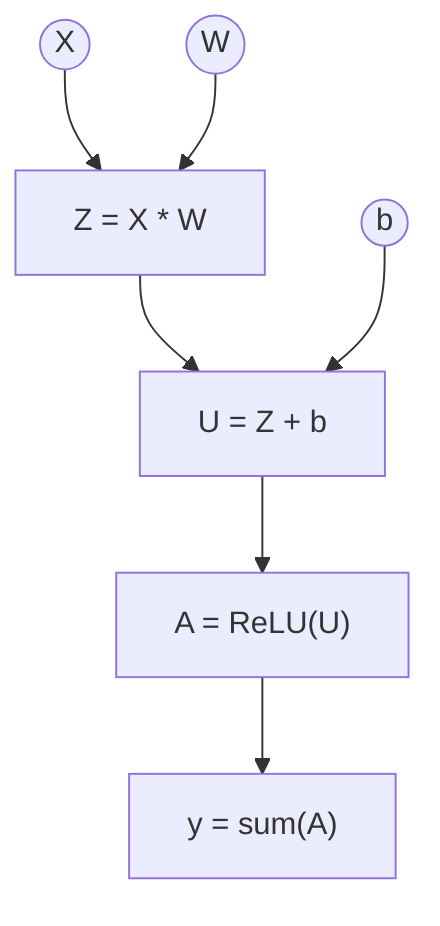

We were able to implement the basic operations ! Well done:)
## Intro 
The basis of this project is to accurately represent the model's computational operations in a graph so that the various parameter gradients can be calculated according to the loss function. We will return to this concept later.For now, we just need to create a graph that represents our model. 

[Full implementation of the graph](https://github.com/Hykrow/engine_rs/tree/main/src/trace)

## Exemple
To begin with, let's assume that we want to calculate, for $$X, W, b \in \mathcal{T}$$

$$
sum(ReLU(X*W+b))
$$

where $$sum$$ means the sum of the elements of the tensor. We therefore have a scalar.

So we break down the operations in this way:
<div style={{ textAlign: "center" }}>


</div>
It can be seen that the graph is a directed acyclic graph (DAG).
## Implémentation du graphe

### Structure

The graph is under this structure
```rust
pub struct Trace{
    nodes: Vec<Node>, 

    params_id: Vec<NodeId>,
}
```
The `Node` is a little more complicated to write. Ignore the `VjpFn` and `vjp`, we'll come back to them later.
A `NodeId` is a `usize`.
```rust
type VjpFn = 
    Box<dyn Fn(&Tensor) -> SmallVec<[(NodeId, Tensor); 2]> +Send + Sync>;

pub struct Node{ 

    pub value: Tensor, 

    pub parents_id: Vec<NodeId>,

    pub vjp: Option<VjpFn>,

}

```

### Fonctions helper

We can introduce a few helper functions to make `Trace` easier to use:
```rust
impl Trace{
    pub fn push(&mut self, node: Node) -> NodeId {
        let id = self.len();
        self.nodes.push(node); 
        id
    }
    pub fn input(&mut self, t: Tensor) -> NodeId {
        self.push(Node{
            value: t, 
            parents_id: SmallVec::new(), 
            vjp: None, 
        })
    }
    pub fn get_tensor(&self, id: NodeId)-> &Tensor {
        &self.nodes[id].value
    }
    pub fn new() -> Trace {
        Trace { nodes: Vec::new(), params_id: Vec::new() }
    }
    
    pub fn param(&mut self, t: Tensor) -> NodeId {
        let id = self.push(Node{
            value: t, 
            parents_id: SmallVec::new(), 
            vjp: None, 
        }); 
        self.params_id.push(id); 
        id
    }
} 
```
## Ordre topologique

Since the graph is a DAG, it can be equipped with a topological order. 
In the previous example:
<div style={{ textAlign: "center" }}>


</div>
So the order is 

$$
X = W \prec Z = b \prec U \prec A \prec y
$$
This order is implemented as follows: 
```rust
impl Trace{
    pub fn order(&self, root: NodeId) -> Vec<NodeId>
    {
        let mut order: Vec<NodeId> = Vec::with_capacity(self.len());
        let mut visited = vec![false; self.len()];

        fn dfs(tr: &Trace, visited: &mut Vec<bool>, order: &mut Vec<NodeId>, u: NodeId)
        {
            if visited[u]{
                return;
            }
            visited[u]= true; 
            for &p in &tr.nodes[u].parents_id{
                dfs(tr, visited, order, p);
            }
            order.push(u);
        }
        dfs(&self, &mut visited, &mut order, root);
        order.reverse();
        order

    }
}
```
