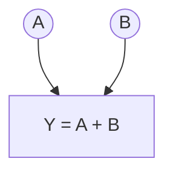
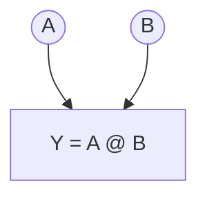
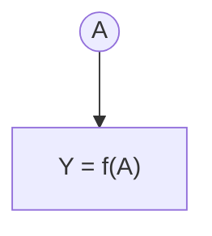

## Définition

$$
\text{Soit } f : \mathcal{T} \to \mathbb{R} \text{ une fonction différentiable, où } 
\mathcal{T} \text{ est l'espace des tenseurs.}
$$

$$
\text{Le gradient de } f \text{ en } A \in \mathcal{T} \text{ est le tenseur } 
\nabla f(A) \in \mathcal{T}
\text{ défini par :}
$$

$$
\forall\, dA \in \mathcal{T}, \text{ t.q. } \mathcal{d}_{dA}(-1) = \mathcal{d}_A(-1), \qquad 
\mathrm{D}f(A)[dA] = \langle \nabla f(A),\, dA \rangle
$$
Ceci se lit comme la variation de $$f$$ évalué en $$A$$ pour une petite variation $$dA$$ quelconque.

 Pour des scalaires, c'est la définition attendue:
 
  $$dA = h \in \mathbb R $$ et $$Df(A)[h] = \langle f'(A), h \rangle = h*f'(A)  = f(A+h) -f(A) $$ pour $h$ assez petit. ($$\nabla f(A) = f'(A)$$)

Lorsqu'on a introduit le graphe, on a vu que les noeuds représentaient une opération et pointaient vers d'autres opérations (ou un scalaire si on était à la fin du graphe).
Ce scalaire (souvent noté $$L$$) représentera une fonction de perte. On reviendra sur cette fonction plus tard.
Il faut juste comprendre que $$L$$ montrera les performances du modèle, donc que plus $$L$$ est faible, mieux le modèle se comporte. On cherche donc à optimiser les paramètres selon $$L$$.

## Opérations usuelles - gradients
Pour ce faire, on va commencer par calculer les gradients de chaque tenseur selon l'ordre topologique donné précédemment. 
On va donc commencer par $$L$$, car son gradient vaut 1 trivialement. 

Puis, on va calculer le gradient de chaque noeud dans l'ordre topologique inversé en utilisant les gradients déjà calculés. 

Le but et de **calculer le gradiant de A, B** (ou **A**) **sachant le gradiant de f(A, B)** (ou **f(A)**)
### Addition

Soit $L:\mathcal T\to\mathbb R$ différentiable et $f:\mathcal T^2\to\mathcal T$, $f(A,B)=A+B$.
Posons $Y=f(A,B)$ et $G=\nabla_Y L\big|_{Y=f(A,B)} \in \mathcal T$

Un bout du graphe (l'application de $$f$$) ressemble donc à ça : 

Notons d'abord que
 $$
 dY = Df(A, B)[dA, dB] = dA+dB 
 $$
 $$
 \text{car } f(A+dA, B+dB)-f(A, B) = dA+dB
 $$

En développant $$ L\circ f $$ et d'après la chain rule et la définition de la différentielle, on a : 
$$
\mathrm D(L \circ f)(A,B)[\mathrm dA,\mathrm dB]
= \mathrm DL\big(f(A,B)\big)\big[\,\mathrm Df(A,B)[\mathrm dA,\mathrm dB]\,\big]
$$

$$
= dL(Y)[dY]
= \langle G, dY \rangle

$$

$$
= \langle G,\ \mathrm dA+\mathrm dB\rangle = \langle G, \mathrm dA \rangle + \langle G, \mathrm dB \rangle
$$

Par ailleurs, (définition)
$$
\mathrm D(L \circ f)(A,B)[\mathrm dA,\mathrm dB]
= \langle \nabla_A L,\,\mathrm dA\rangle + \langle \nabla_B L,\,\mathrm dB\rangle.
$$

En identifiant (valable pour tout $(\mathrm dA,\mathrm dB)$) :
$$
\boxed{\ \nabla_A L =  \nabla_B L\ = G } \qquad\text{où } G=\nabla_Y L\big|_{Y=A+B}
$$

### Multiplication 

Soit $L:\mathcal T\to\mathbb R$ différentiable et $f:\mathcal T^2\to\mathcal T$, $f(A,B)=A@B$. (multiplication tensorielle)
Posons $Y=f(A,B)$ et $G=\nabla_Y L\big|_{Y=f(A,B)} \in \mathcal T$

Un bout du graphe (l'application de $$f$$) ressemble donc à ça : 

Notons d'abord que
 $$
 dY = Df(A, B)[dA, dB] =  A@dB + dA@B
 $$
 $$
 \text{car } f(A+dA, B+dB)-f(A, B) = A@dB + dA@B + dA@dB = A@dB + dA@B
 $$

En développant $$ L\circ f $$ et d'après la chain rule et la définition de la différentielle, on a : 
$$
\mathrm D(L \circ f)(A,B)[\mathrm dA,\mathrm dB]
= \mathrm DL\big(f(A,B)\big)\big[\,\mathrm Df(A,B)[\mathrm dA,\mathrm dB]\,\big]
$$

$$
= DL(Y)[dY]
= \langle G, dY \rangle

$$

$$
= \langle G,\ \mathrm dA+\mathrm dB\rangle = \langle G, \mathrm A@dB \rangle + \langle G, \mathrm dA@B \rangle
$$

$$
= \langle A^\top @ G, dB \rangle + \langle  G @ B^\top, dA \rangle  \text{ (définition du produit scalaire)}
$$
Par ailleurs, (définition)
$$
\mathrm D(L \circ f)(A,B)[\mathrm dA,\mathrm dB]
= \langle \nabla_A L,\,\mathrm dA\rangle + \langle \nabla_B L,\,\mathrm dB\rangle.
$$

En identifiant (valable pour tout $(\mathrm dA,\mathrm dB)$) :
$$
\boxed{\ \nabla_A L =  G @ B^\top,   \nabla_B L\ = A^\top @ G} \qquad\text{où } G=\nabla_Y L\big|_{Y=A@B}
$$

### Application de fonction

Soit $L:\mathcal T\to\mathbb R$ différentiable et $f:\mathcal T\to\mathcal T$. (appliquée élément par élément) (ex: tanh, ReLU)

On peut donc définir $$f'$$ comme la dérivée de $$f$$ dans $$\mathbb{R}$$ (appliquable à un tenseur), car en réalité $$f: \mathbb{R} \to \mathbb{R}$$, on l'a juste étendue pour l'appliquer sur chaque élément du tenseur.

Posons $Y=f(A)$ et $G=\nabla_Y L\big|_{Y=f(A)} \in \mathcal T$ 

Un bout du graphe (l'application de $$f$$) ressemble donc à ça : 

Notons d'abord que comme $f$ agit point par point, avec $$i = (i_1, ..., i_N)$$ un indice ($$T_i$$ est donc scalaire)
$$
\big[\mathrm Df(T)[\mathrm dT]\big]_{i}=f'(T_i)\,\mathrm dT_i
\quad\Longrightarrow\quad
dY = \mathrm Df(T)[\mathrm dT]=f'(T)\odot \mathrm dT.
$$ 
où $$ \odot $$ signifie la multiplication élément par élément. (hadamard)

En développant $$ L\circ f $$ et d'après la chain rule et la définition de la différentielle, on a : 
$$
\mathrm D(L \circ f)(A)[\mathrm dA]
= \mathrm DL\big(f(A)\big)\big[\,\mathrm Df(A)[\mathrm dA]\,\big]
$$

$$
= DL(Y)[dY]
= \langle G, dY \rangle

$$

$$
= \langle G,\ f'(A) \odot dA\rangle  = \langle f'(A)\odot G, dA \rangle   \tag{*}
$$

Par ailleurs, (définition)
$$
\mathrm D(L \circ f)(A)[\mathrm dA]
= \langle \nabla_A L,\,\mathrm dA\rangle .
$$

En identifiant (valable pour tout $(\mathrm dA,\mathrm dB)$) :
$$
\boxed{\ \nabla_A L =  f'(A) \odot G,  } \qquad\text{où } G=\nabla_Y L\big|_{Y=f(A)}
$$

(*) est très simple à dériver: 
$$\langle X, Y \odot Z \rangle = x_{bij}y_{bij}z_{bij} $$ avec $$b$$ l'indice de batch. On voit bien que tout commute, et que donc $$\langle X, Y \odot Z \rangle =\langle Y \odot X , Z \rangle $$

