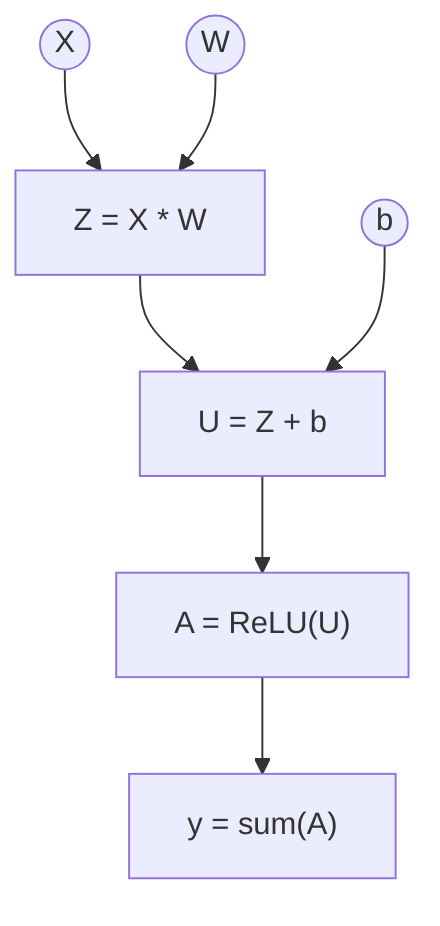

Nous avons pu implémenter les opérations de base ! Bravo :)
## Intro 
La racine de ce projet est de bien représenter les operations de calcul du modèle dans un graphe afin de pouvoir calculer les différents gradients des paramètres selon la fonction de perte. On reviendra à cette notion plus tard. 
Pour l'instant il faut juste créer un graphe qui représente notre modèle. 

[Lien github:](https://github.com/Hykrow/engine_rs/tree/main/src/trace)

## Exemple
Pour commencer, supposons qu'on veuille calculer, pour $$X, W, b \in \mathcal{T}$$

$$
sum(ReLU(X*W+b))
$$

où $$sum$$ signifie la somme des éléments du tenseur. On a donc un scalaire.

Alors on décompose les opérations de cette manière
<div style={{ textAlign: "center" }}>


</div>
On peut remarque que le graphe est dirigé acyclique (DAG).
## Implémentation du graphe

### Structure

Le graphe est sous cette structure
```rust
pub struct Trace{
    nodes: Vec<Node>, 

    params_id: Vec<NodeId>,
}
```
Le `Node` est un peu plus compliqué à écrire. Ignorez les `VjpFn` et `vjp`, on reviendra dessus.
Un `NodeId` est un `usize`.
```rust
type VjpFn = 
    Box<dyn Fn(&Tensor) -> SmallVec<[(NodeId, Tensor); 2]> +Send + Sync>;

pub struct Node{ 

    pub value: Tensor, 

    pub parents_id: Vec<NodeId>,

    pub vjp: Option<VjpFn>,

}

```

### Fonctions helper

On peut introduire quelques fonctions helper pour faciliter l'utilisation de `Trace`:
```rust
impl Trace{
    pub fn push(&mut self, node: Node) -> NodeId {
        let id = self.len();
        self.nodes.push(node); 
        id
    }
    pub fn input(&mut self, t: Tensor) -> NodeId {
        self.push(Node{
            value: t, 
            parents_id: SmallVec::new(), 
            vjp: None, 
        })
    }
    pub fn get_tensor(&self, id: NodeId)-> &Tensor {
        &self.nodes[id].value
    }
    pub fn new() -> Trace {
        Trace { nodes: Vec::new(), params_id: Vec::new() }
    }
    
    pub fn param(&mut self, t: Tensor) -> NodeId {
        let id = self.push(Node{
            value: t, 
            parents_id: SmallVec::new(), 
            vjp: None, 
        }); 
        self.params_id.push(id); 
        id
    }
} 
```
## Ordre topologique

Comme le graphe est un DAG, on peut le munir d'un ordre topologique. 
Dans l'exemple précédent:
<div style={{ textAlign: "center" }}>


</div>
Alors l'ordre est 

$$
X = W \prec Z = b \prec U \prec A \prec y
$$
L'implémentation de cet ordre se fait tel quel : 
```rust
impl Trace{
    pub fn order(&self, root: NodeId) -> Vec<NodeId>
    {
        let mut order: Vec<NodeId> = Vec::with_capacity(self.len());
        let mut visited = vec![false; self.len()];

        fn dfs(tr: &Trace, visited: &mut Vec<bool>, order: &mut Vec<NodeId>, u: NodeId)
        {
            if visited[u]{
                return;
            }
            visited[u]= true; 
            for &p in &tr.nodes[u].parents_id{
                dfs(tr, visited, order, p);
            }
            order.push(u);
        }
        dfs(&self, &mut visited, &mut order, root);
        order.reverse();
        order

    }
}
```
